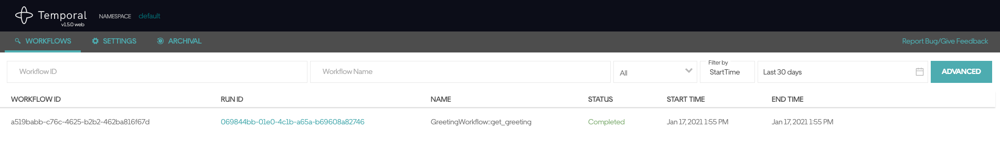

# Getting Started

This document is meant to help beginners to temporal.io and this python SDK client to get started

## Who is our audience?

We write this document for these three personas in mind.

Aïsha uses Django and Python heavily in her day job as a solo web developer running her own freelance business. She recently heard about temporal.io and wanted to play with it. She has in mind a possible use case for this in an on-going project in the day job. Perhaps using temporal will help her achieve the business goals of serving her customers better. Hence, she prefers to use a Python SDK as much as possible. Since she runs her own business, she prefers tutorials that get straight to the point as quickly as possible.

Rupinder is studying computer science degree at college. He experiments a lot with open source projects he encounters. His experience is limited to mostly school projects, but he has been quite comfortable with Python since that was the first one the school uses to teach 101 programming to the undergraduates. Having said that, he prefers tutorials that are gentle with beginner developers such as himself by avoiding unnecessary jargon.

Yim is a project manager. They used to be in technical roles but now they are a PM for 5 years. They found this temporal.io by chance on the internet and wanted to evaluate if this is something they can recommend back at their employer. Their purpose is to add value to the workflow software they are selling. Since they have technical background but doing a more management role, they prefer tutorials written not just for pure technical developers, but also for technical literate project managers like themselves. Tutorials that also cover business/domain concerns which better help them to sell the idea of adding temporal.io back at the employer's.

Like these three personas, readers should:

- Know how to write basic Python

- Know how to create virtual environments on their own laptops

- Use Git to save and share files. (It's OK not to know the more obscure commands.)

- At least have some rough idea what temporal.io offers

## Install and run this SDK to showcase a HelloActivity workflow

This guide will show you how to quickly install and run an example.

Prerequisites:
1. You know how to create your own python virtual env
2. You have Docker and Docker-Compose installed

This section essentially has 5 subsections:
1. Ensure temporal.io is installed and running
2. Ensure sdk is installed and ready
3. Prepare and run a HelloActivity example

### 1. Ensure temporal.io is installed and running

The canonical source is from [temporal.io docs](https://docs.temporal.io/docs/server-quick-install/#run-the-temporal-server)

**Skip this if you already have Temporal Server running locally.**

The following steps will run a local instance of the Temporal Server using the default configuration file:

1. Clone the temporalio/docker-compose repository.
2. Change directory into the root of the project.
3. Run the docker-compose up command.


```
git clone https://github.com/temporalio/docker-compose.git
cd  docker-compose
docker-compose up
```

After the Temporal Server has started you can view the Temporal Web interface in your browser: [localhost:8088](http://localhost:8088/)

To stop the Temporal Server,  press `Ctrl+C` in the same terminal window

### 2. Ensure sdk is installed and ready

The following steps will clone the sdk and then install all the dependencies

1. Clone the [firdaus/temporal-python-sdk](https://github.com/firdaus/temporal-python-sdk) repository.
2. Change directory into the root of the project.
3. Make a new Python virtual env for this project (if you haven't already). Then, activate the virtual env.
4. Install the dependencies via pip

```
git clone https://github.com/firdaus/temporal-python-sdk
cd  temporal-python-sdk
# Important! How you make and/or activate your virtual env depends on your OS and your choice of the virtual env software.
# Please consult sources such as https://realpython.com/python-virtual-environments-a-primer/#using-virtual-environments on how.
pip install -r requirements.txt
```

### 3. Prepare and run a HelloActivity example

The following steps will result in a HelloActivity showing up in the localhost interface

1. Create a new file called `helloactivity.py` in the root of project.
2. Copy paste the sample code shown below into `helloactivity.py`
3. Run `python helloactivity.py`

#### HelloActivity code

This sample code was provided by maintainer @firdaus in the [discussion comment](https://github.com/firdaus/temporal-python-sdk/discussions/1#discussioncomment-265772).

```python
import asyncio
import sys
import logging
from datetime import timedelta

from temporal.activity_method import activity_method
from temporal.workerfactory import WorkerFactory
from temporal.workflow import workflow_method, Workflow, WorkflowClient

logging.basicConfig(level=logging.INFO)

TASK_QUEUE = "HelloActivity-python-tq"
DOMAIN = "default"

# Activities Interface
class GreetingActivities:
    @activity_method(task_queue=TASK_QUEUE, schedule_to_close_timeout=timedelta(seconds=1000))
    def compose_greeting(self, greeting: str, name: str) -> str:
        raise NotImplementedError


# Activities Implementation
class GreetingActivitiesImpl:
    def compose_greeting(self, greeting: str, name: str):
        return greeting + " " + name + "!"


# Workflow Interface
class GreetingWorkflow:
    @workflow_method(task_queue=TASK_QUEUE)
    async def get_greeting(self, name: str) -> str:
        raise NotImplementedError


# Workflow Implementation
class GreetingWorkflowImpl(GreetingWorkflow):

    def __init__(self):
        self.greeting_activities: GreetingActivities = Workflow.new_activity_stub(GreetingActivities)
        pass

    async def get_greeting(self, name):
        return await self.greeting_activities.compose_greeting("Hello", name)


async def client_main():
     client = WorkflowClient.new_client(namespace=DOMAIN)
     greeting_workflow: GreetingWorkflow = client.new_workflow_stub(GreetingWorkflow)
     result = await greeting_workflow.get_greeting("Python")
     print(result)

if __name__ == '__main__':
    factory = WorkerFactory("localhost", 7233, DOMAIN)
    worker = factory.new_worker(TASK_QUEUE)
    worker.register_activities_implementation(GreetingActivitiesImpl(), "GreetingActivities")
    worker.register_workflow_implementation_type(GreetingWorkflowImpl)
    factory.start()

    asyncio.run(client_main())

    print("Stopping workers....")
    worker.stop()
    print("Workers stopped...")
    sys.exit(0)
```


```
# inside the root of the project
python helloactivity.py
```

Go to [localhost:8088](http://localhost:8088/) and you should see something like this:

